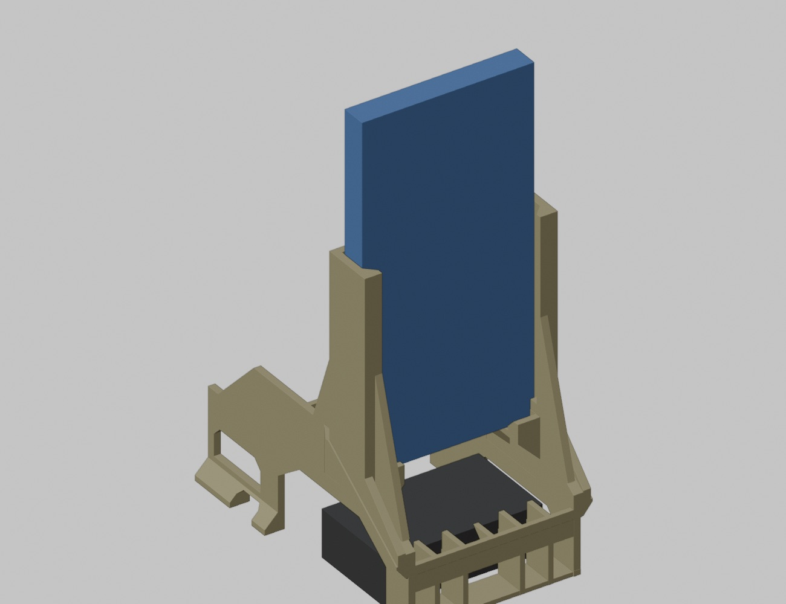

# ACEBOTT QD001 Phone Camera Mount

3D-printable, one-piece phone mount for the ACEBOTT QD001 mecanum-wheel robot car.
The phone stands upright (90°) above the battery box so its **rear camera works as the
car's forward-looking camera**; the screen faces the rear of the car.

Designed for a **Bambu Lab A1 mini**, printed upright with **no supports**.

## Files

| Path | What it is |
|---|---|
| `models/current/ACEBOTT_QD001_PhoneMount_V7_90deg_OnePiece.stl` | **Print this.** V7, fixed 90°, one piece, 104.3 cm³, 91 × 138 × 150 mm |
| `models/current/spoiler_v9_fable_v7.blend` | Blender source of V7 (object `V7_Body`) |
| `models/legacy/ACEBOTT_QD001_PhoneMount_V6_…_DO-NOT-PRINT.stl` | V6 — tower stood on the mast and blocked the wire bundle. Kept for reference only |
| `models/legacy/FableV4_OnePiece.stl` | V4 — 35° "spoiler" version. Printed and installed; its lower half is the verified base that V6 is built on |
| `models/legacy/spoiler_v7_fable_v5_stepped-angle-concept.blend` | V5 concept: 100° tower with a 3-step (90/95/100°) tread floor. Superseded by V6 |
| `docs/DESIGN_NOTES.md` | Geometry, constraints, load path, what was verified on the real car |
| `docs/PRINTING.md` | Slicer settings, orientation, risk notes |
| `docs/images/` | Photos of V4 on the car and the annotated side view used to plan V6 |
| `docs/renders/` | Blender renders of V7, V6 and the V5 concept |
| `reference/scripts/` | Python used in Blender to build/check/export the parts (`build_v7.py` reproduces V7 from the V4 STL) |
| `reference/photos/` | Full-size photos of V4 installed |

## Phone

Sized for a Pixel with a case: slot **81.5 mm** wide, **18.5 mm** deep, phone bottom ~54 mm above
the upper chassis plate. The top ~55 mm of the phone (camera bar) is left completely free.
USB‑C cable exits downward through the open centre of the floor.

## Status

- V4: printed, installed, verified fit (USB‑C window, screw notches, battery bay, wiring).
- V6: never printed — its tower sat inside the wire-bundle space in front of the mast (see `docs/DESIGN_NOTES.md`, "Wire keep-out").
- V7: tower moved behind the mast; wire chamber proven empty by boolean check. Geometry verified in software only (watertight, no islands, bridges as V4 plus one 30 mm arch). **Not yet printed.**

## License

MIT — see `LICENSE`.
